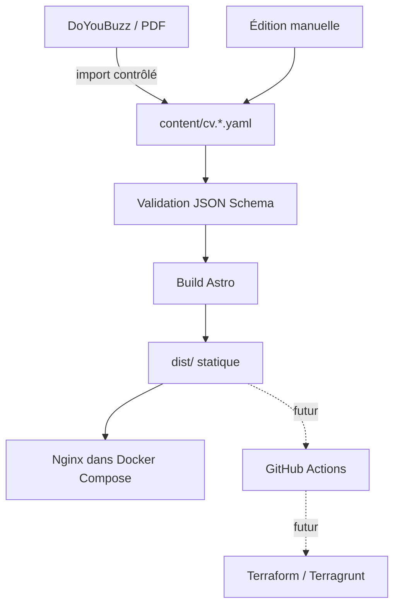

# Architecture

## Vue d’ensemble

## Responsabilités

- `content/` contient la source éditoriale bilingue et son contrat de validation.
- `site/` contient exclusivement la présentation Astro, les styles et les ressources publiques.
- `scripts/` contient les validations et, plus tard, les outils d’import ou de génération.
- `dist/` est un artefact généré et ne doit jamais être modifié ni versionné.
- `docs/decisions/` conserve les raisons des choix structurants.
- `infra/` sera créé lorsque la cible de déploiement distante sera choisie.

## Flux de contenu

Les versions française et anglaise partagent le même schéma et les mêmes identifiants fonctionnels. Les textes restent séparés afin qu’une traduction puisse être revue sans toucher à la présentation.

La source initiale est DoYouBuzz :

- français : <https://www.doyoubuzz.com/yoann-lascaux/senior-platform-engineer-sre> ;
- anglais : <https://www.doyoubuzz.com/yoann-lascaux/gb> ;
- PDF français : <https://www.doyoubuzz.com/yoann-lascaux/senior-platform-engineer-sre/download>.

DoYouBuzz n’est pas une dépendance du build : toutes les données publiées sont versionnées dans ce dépôt.

## Exécution locale

Le build multi-stage produit les fichiers avec Node.js puis les sert avec Nginx. Docker Compose expose le site sur `http://localhost:4321`.

Cette cible locale valide le contrat de déploiement d’un artefact statique sans préjuger du futur fournisseur cloud.

## Contraintes de sécurité

- aucun secret dans le contenu ou dans l’image ;
- aucun état Terraform dans Git ;
- aucune récupération de contenu externe pendant le build ;
- aucune publication automatique d’un import ;
- liens externes ouverts avec les protections adaptées ;
- en-têtes HTTP de base configurés dans Nginx.

## Évolutions prévues

GitHub Actions construira une seule fois un artefact immuable. Terraform décrira les ressources et Terragrunt fournira les paramètres par environnement. Le choix de l’hébergeur et la topologie préproduction/production seront enregistrés dans un nouvel ADR.
