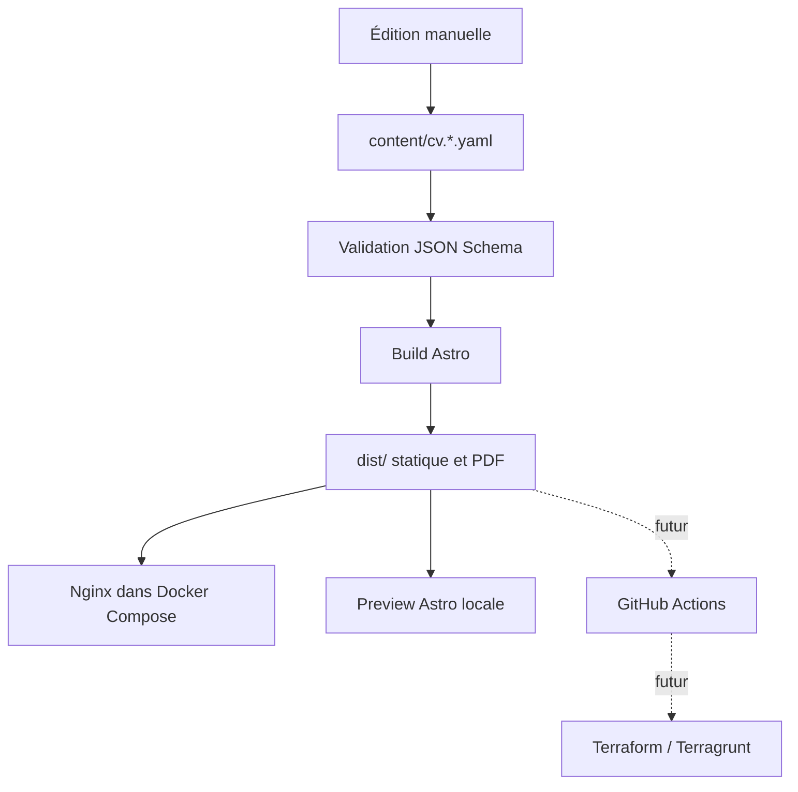

# Architecture

## Vue d’ensemble

## Responsabilités

- `content/` contient la source éditoriale bilingue et son contrat de validation.
- `site/` contient exclusivement la présentation Astro, les styles et les ressources publiques.
- `scripts/` contient la validation, le démarrage de la preview et la génération PDF.
- `dist/` est un artefact généré et ne doit jamais être modifié ni versionné.
- `docs/decisions/` conserve les raisons des choix structurants.
- `infra/` sera créé lorsque la cible de déploiement distante sera choisie.

## Flux de contenu

Les versions française et anglaise partagent le même schéma et les mêmes identifiants fonctionnels. Les textes restent séparés afin qu’une traduction puisse être revue sans toucher à la présentation.

Les fichiers YAML versionnés constituent l’unique source de vérité. Chaque modification passe par la validation du schéma, les contrôles Astro et les tests avant la génération de l’artefact statique.

## Exécution locale

Docker Compose expose deux modes utilisant les mêmes contenus :

- `cv` sur `http://localhost:4321`, construit dans une image multi-stage puis servi avec Nginx ;
- `preview` sur `http://localhost:4322`, qui construit Astro, génère les PDF puis sert l’artefact avec le serveur de preview Astro.

Cette organisation permet de travailler sur le rendu et les PDF via `preview`, puis de vérifier séparément l’image statique proche de la future cible de déploiement.

## Contraintes de sécurité

- aucun secret dans le contenu ou dans les images ;
- aucun état Terraform dans Git ;
- aucune récupération de contenu externe pendant le build ou les tests ;
- liens externes ouverts avec les protections adaptées ;
- en-têtes HTTP de base configurés dans Nginx.

## Évolutions prévues

GitHub Actions construira une seule fois un artefact immuable. Terraform décrira les ressources et Terragrunt fournira les paramètres par environnement. Le choix de l’hébergeur et la topologie préproduction/production seront enregistrés dans un nouvel ADR.
