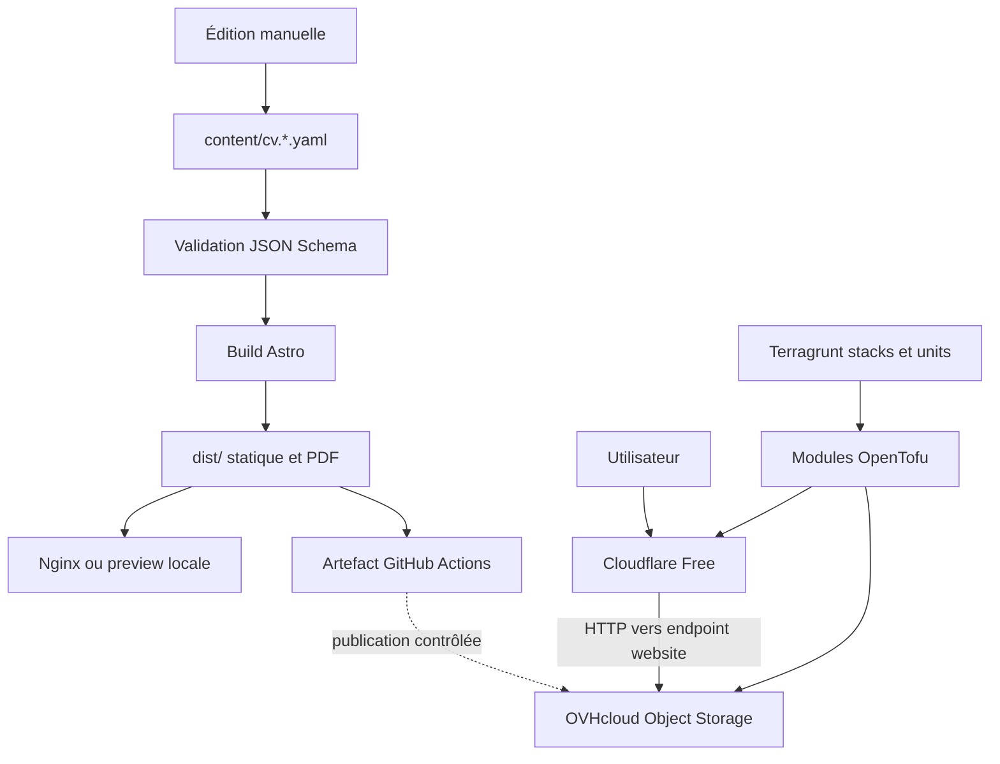

# Architecture

## Vue d’ensemble

## Responsabilités

- `content/` contient la source éditoriale bilingue et son contrat de validation.
- `site/` contient exclusivement la présentation Astro, les styles et les ressources publiques.
- `scripts/` contient la validation, le démarrage de la preview et la génération PDF.
- `dist/` est un artefact généré et ne doit jamais être modifié ni versionné.
- `deploy/terraform/` contient les modules OpenTofu locaux nécessaires pour OVHcloud et Cloudflare.
- `deploy/units/` contient les unités Terragrunt paramétrables.
- `deploy/live/` compose les stacks par environnement ; seule `production` existe actuellement.
- `docs/decisions/` conserve les raisons des choix structurants.

## Flux de contenu

Les versions française et anglaise partagent le même schéma et les mêmes identifiants fonctionnels. Les fichiers YAML versionnés constituent l’unique source de vérité. Chaque modification passe par la validation du schéma, les contrôles Astro et les tests avant la génération d’un artefact statique immuable.

Le contenu de `dist/` n’est pas géré par OpenTofu. Après succès de la CI sur `main`, le workflow de publication télécharge l’artefact immuable associé au commit, le synchronise vers le bucket OVHcloud avec `s3cmd`, puis purge le hostname Cloudflare. Il ne reconstruit jamais le site. Une ancienne exécution CI peut être sélectionnée manuellement pour effectuer un rollback.

## Infrastructure publique

Le bucket OVHcloud porte le nom `cv.yoann-lascaux.fr`. Ce nom identique au FQDN est nécessaire parce que Cloudflare Free transmet le header `Host` original et ne permet pas son remplacement par une Origin Rule.

Cloudflare fournit le certificat public, le proxy, le CDN, le cache et les en-têtes de sécurité. La règle `ssl = flexible` est limitée à `http.host eq "cv.yoann-lascaux.fr"`. L’endpoint Static Website OVHcloud ne prenant pas en charge HTTPS, la liaison Cloudflare → origine reste en HTTP.

Le provider `ovh/ovh` gère le bucket, son chiffrement et son versionnement. Il n’expose pas l’ACL `public-read` ni la configuration Static Website : ces réglages sont appliqués explicitement avec `s3cmd` et doivent être contrôlés après changement.

## DNS

Cloudflare doit devenir authoritative pour toute la zone `yoann-lascaux.fr`. Le passage des nameservers chez OVH reste une opération humaine et ne doit avoir lieu qu’après inventaire et migration de tous les enregistrements, en particulier MX, SPF, DKIM et DMARC.

## État et déploiement

Chaque unité utilise un backend S3-compatible dans un bucket OVHcloud Object Storage privé, séparé du bucket public. Le nom du bucket est injecté par `TG_STATE_BUCKET`. Les clés produites sont `production/storage/tofu.tfstate` et `production/edge/tofu.tfstate`. Le bucket doit être versionné et le verrouillage natif par fichier est activé avec `use_lockfile`.

Les credentials S3 OVHcloud du backend sont transmis par les variables attendues par le client S3 d’OpenTofu. Ils ne sont ni écrits dans les fichiers Terragrunt ni exposés à la CI de validation. Les états locaux issus d’exécutions antérieures doivent être migrés avec `init -migrate-state` depuis leurs unités d’origine avant toute régénération ou suppression des caches.

La CI générale exécute formatage, initialisation des modules sans backend, validation et génération de la stack sans credential. Un workflow séparé exécute un plan authentifié sur les pull requests internes touchant l’infrastructure. Après fusion dans `main`, il recalcule les plans et attend l’approbation de l’environnement GitHub `production-infrastructure` avant de vérifier leur stabilité et de les appliquer. Les pull requests provenant de forks n’accèdent jamais aux secrets.

## Exécution locale

Docker Compose expose deux modes utilisant les mêmes contenus :

- `cv` sur `http://localhost:4321`, construit dans une image multi-stage puis servi avec Nginx ;
- `preview` sur `http://localhost:4322`, qui construit Astro, génère les PDF puis sert l’artefact avec Astro.

Le flake Nix épingle les outils de développement et d’infrastructure. `.envrc` charge ce shell avec direnv.

## Contraintes de sécurité

- aucun secret dans le contenu, les images ou les fichiers Terragrunt ;
- aucun état OpenTofu dans Git ;
- aucun `apply` de production avant le plan de pull request et l’approbation de l’environnement GitHub protégé ;
- bucket public réservé au contenu destiné à être publié ;
- tokens OVHcloud et Cloudflare limités aux permissions nécessaires ;
- aucun changement automatisé des nameservers ;
- aucun service, provider ou module AWS.

## Préproduction

Une préproduction n’est pas encore créée faute de second hostname et pour limiter la complexité initiale. Elle devra être une stack séparée avec son propre FQDN, son propre bucket et des credentials/protections distincts avant l’automatisation du CD.
